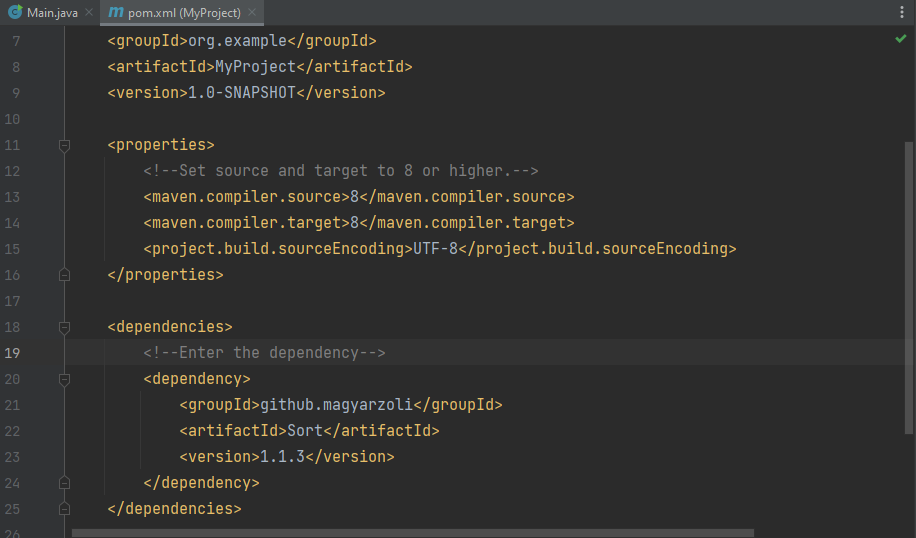

[][license]

# Sort Hierarchy

## Description
The Sort Hierarchy is a comprehensive software project designed
to provide efficient sorting algorithms for Java applications.

---

## Project Goals
### **Efficient Sorting:**
The primary goal of this project is to implement various sorting algorithms, including
insertion sort, bubble sort, quicksort, mergesort, and many others. These sorting
algorithms are designed to handle different types of data and scenarios efficiently.

### **Testing Framework:**
Alongside the sorting algorithms, the project includes a robust testing framework
that allows developers to rigorously test the algorithms in various scenarios,
from basic sorting to complex edge cases.

### **Documentation:**
The project places a strong emphasis on documentation, ensuring that both users
and developers can easily understand, use, and contribute to the software.

### **Sorting Algorithms:**
A comprehensive collection of sorting algorithms, each with different strengths
and use cases.

---

## Target Audience
### **Developers:**
Sort Hierarchy is primarily aimed at software developers
working with Java applications who require efficient
sorting algorithms and a testing framework.

### **Academic and Educational Use:**
Students and educators in computer science can benefit
from Sort Hierarchy for learning and teaching sorting
algorithms and best practices in software development.

---

## System Architecture
### **Overview:**
The system architecture of the Sort Hierarchy is designed to provide a modular
and extensible framework for sorting algorithms and a testing suite. The
architecture follows a clear separation of concerns, making it easy to add, test,
and use different sorting algorithms efficiently.

### **Diagram:**
[][sortDiagram]

### **Charts:**
[][timeComplexity]
---

## User Guide
Before you start using Sort Hierarchy, ensure you<br>
have the following prerequisites in place:
- Create new Project
    - Languages: `Java`
    - Build System : `Maven`
    - Java Development Kit (JDK): `1.8` or `higher`

### **Dependency:**
**Maven:**
```xlm
<dependency>
    <groupId>github.magyarzoli</groupId>
    <artifactId>Sort</artifactId>
    <version>1.1.3</version>
</dependency>
```

### **Installation:**
Open pom.xml in your project folder



### **Examples:**
Easy to use.
```{java}
Integer[] array = new Integer[]{-3, 9, 0, 4, -5, 10, -1, -8, 9, 0};
System.out.println(Arrays.toString(array));
Sorter sorter = new Quick();
sorter.sortArray(array, INCREASING);
System.out.println(Arrays.toString(array));
```
```{bash}
[-3, 9, 0, 4, -5, 10, -1, -8, 9, 0]
[-8, -5, -3, -1, 0, 0, 4, 9, 9, 10]
```

It is also possible to create your own sorting class.
- You can specify it by inheriting an already existing
  arrangement that contains the already defined algorithm,
  and you can transform or overwrite it to your liking.
- It is possible to create your own hybrid arrangement by
  inheriting one of the Another abstract classes so that
  you can define which arrangements or your own
  arrangements you want to combine.
- If you have a different idea than the pre-built sorting
  classes, you can implement more outline methods
  for sorting that you can define.
- It is possible to create an arrangement class that only
  manages a certain collection or data type, data types,
  with the help of a generic implementation.

---

### Author
Magyar Zoltán

### Contact
magyarz95@gmail.com

[license]: https://www.apache.org/licenses/LICENSE-2.0
[sortDiagram]: image/diagram/Sort%20diagram.png
[timeComplexity]: image/chart/Time%20Complexity%20diagram.png